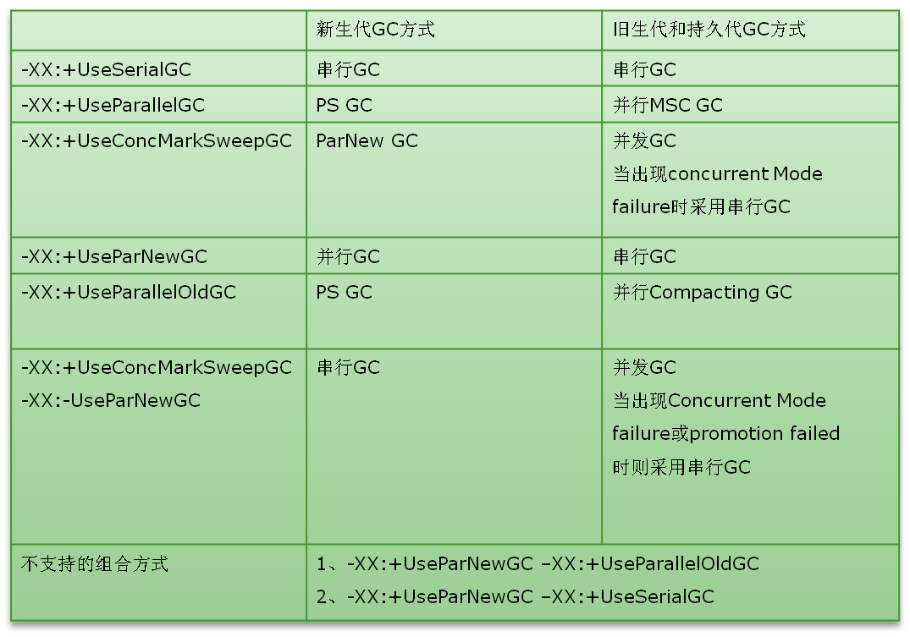

+++
title = "Jvm GC Options"
description = "Notes on JVM gc types & options"
date = 2018-02-05T16:16:53+08:00
draft = false
template = "page.html"
[taxonomies]
categories =  ["Notes"]
tags = ["jvm", "gc"]
+++

# General options

- `-XX:+PrintFlagsFinal`
- `-XX:+PrintFlagsInitial`
- `-XX:+PrintCommandLineFlags`
- `-XX:+UnlockExperimentalVMOptions`
- `-XX:+UnlockDiagnosticVMOptions`

- `-XX:+ParallelRefProcEnabled`

```
java -server -XX:+UnlockExperimentalVMOptions -XX:+UnlockDiagnosticVMOptions -XX:+PrintFlagsFinal 
java -client -XX:+UnlockExperimentalVMOptions -XX:+UnlockDiagnosticVMOptions -XX:+PrintFlagsFinal 
```

# GC

See following image first:



## Young generation

1. "Serial" 是串行收集器，也是 `-client` 默认的GC收集器，可以 `-XX:+UseSerialGC` 来强制开启
2. "ParNew" 是并行收集齐，也是 `-server` 默认的GC收集器，可以 `-XX:+UseParallelGC` 来强制开启
3. "Parallel Scavenge" 是吞吐量优先收集器，可以通过 `-XX:+UseParallelGC` 来强制开启

## Old generation

1. "CMS" 是 Concurrent Mark Sweep 收集器 

执行阶段：

- CMS-initial-mark
- CMS-concurrent-mark
- CMS-concurrent-preclean
- CMS-remark
- CMS-concurrent-sweep
- CMS-concurrent-reset

相关参数：

- `-XX:+UseConcMarkSweepGC`
- `-XX:CMSFullGCsBeforeCompaction=n`
- `-XX:ParallelGCThreads=n`
- `-XX:+ConcGCThreads=n`

2. "Serail Old" 是串行收集器

3. "Parallel Old" 是并行收集器，可以通过 `-XX:+UseParallelOldGC` 来手动开启

## Flags

1. `-XX:+UseSerialGC`： 相当于"Serial" + "SerialOld"，这个方案直观上就应该是性能最差的
2. `-XX:+UseParallelGC`： 相当于"Parallel Scavenge" + "SerialOld"，也就是说，在young generation中是多线程处理，但是在tenured generation中则是单线程
3. `-XX:+UseParallelOldGC`： 相当于 "Parallel Scavenge" + "ParallelOld"，都是多线程并行处理
4. `-XX:+UseConcMarkSweepGC`： 相当于"ParNew" + "CMS" + "Serial Old"，即在 Young Generation 中采用 "ParNew"，多线程处理；在 Tenured Generation 中使用"CMS"，以求得到最低的暂停时间，但是，采用CMS有可能出现 "Concurrent Mode Failure" ，如果出现了，就只能采用 "SerialOld" 模式了

## Latency

For some GC collectors:

1. `-XX:MaxGCPauseMillis=10000` 
2. `-XX:MaxGCMinorPauseMillis=100`

## throughput

For some GC collectors:

1. `-XX:GCTimeRatio=2`
