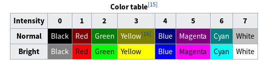
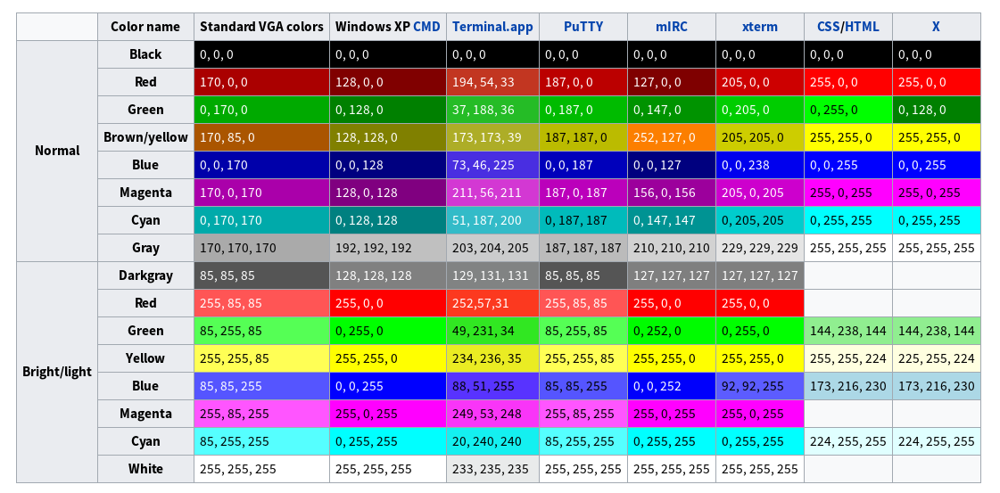

+++
title = "Ansi Colors"
description = "Ansi Colors"
date = 2018-01-08T10:45:11+08:00
draft = false
template = "page.html"
[taxonomies]
categories =  ["Notes"]
tags = ["ansi color"]
+++

在Bash/Zsh里面给命令行输出添加颜色，可以使用ANSI的控制字符串。

基本上能被所有终端都支持的颜色是16种。

<!-- more -->

参见 [ANSI escape code](https://en.wikipedia.org/wiki/ANSI_escape_code) 。

# 16 colors

- Black
- Red
- Green
- Yellow
- Blue
- Megenta
- Cyan
- WHite
- Bright Black
- Bright Red
- Bright Green
- Bright Yellow
- Bright Blue
- Bright Megenta
- Bright Cyan
- Bright WHite





其中，Bright* 是在对应的颜色基础上增强得来。

# ANSI CSI codes

```
- \033[0m : Reset/Normal, all attributes off
- \033[1m : Bold or bright
- \033[4m : Underline
- \033[5m : Blink
- \033[7m : Inverse
- \033[30m : Set foreground (text) color to Black
- \033[31m : Set foreground (text) color to Red
- \033[32m : Set foreground (text) color to Green
- \033[33m : Set foreground (text) color to Yellow
- \033[34m : Set foreground (text) color to Blue
- \033[35m : Set foreground (text) color to Megenta
- \033[36m : Set foreground (text) color to Cyan
- \033[37m : Set foreground (text) color to WHite
- \033[40m : Set background color to Black
- \033[41m : Set background color to Red
- \033[42m : Set background color to Green
- \033[43m : Set background color to Yellow
- \033[44m : Set background color to Blue
- \033[45m : Set background color to Megenta
- \033[46m : Set background color to Cyan
- \033[47m : Set background color to WHite
```

# Examples

```
echo -e "\033[0;31mForeground Red\033[0m"
echo -e "\033[0;1;31mForeground Bright Red\033[0m"
echo -e "\033[0;1;31;44mForeground Bright Red Background Blue\033[0m"
```
