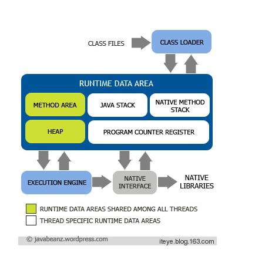
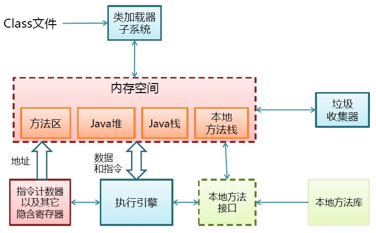

+++
title = "Jvm Memory Model"
description = "Note on JVM memory model"
date = 2018-02-05T16:47:59+08:00
draft = false
template = "page.html"
[taxonomies]
categories =  ["Notes"]
tags = ["jvm", "memory model"]
+++

JVM 的内存模型，从网上整理的图片：

