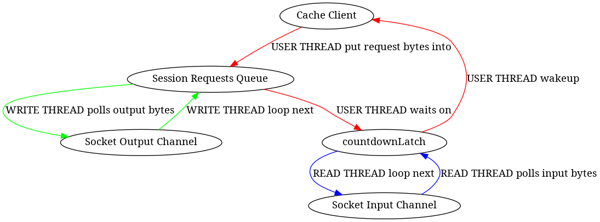
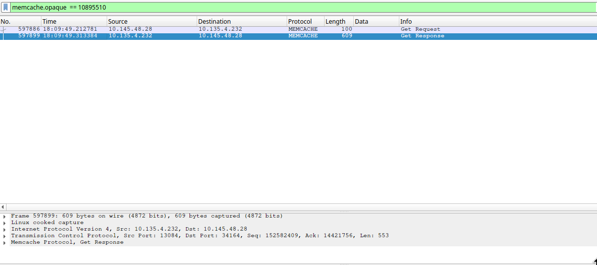
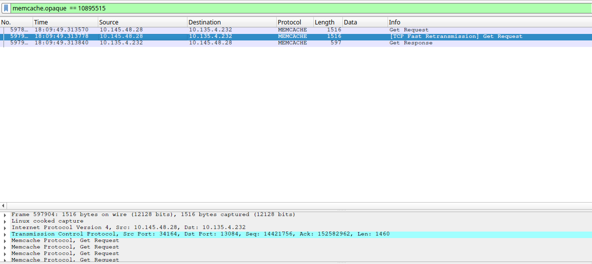
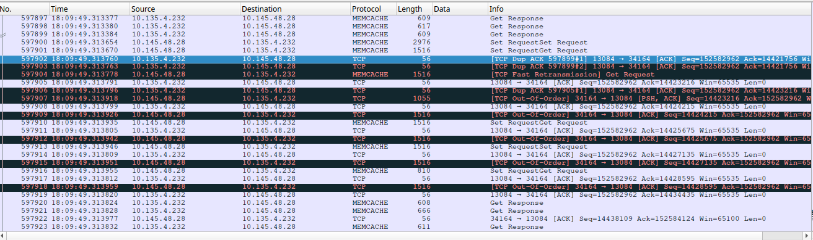

+++
title = "一次 Cache 问题排查实践"
description = "一次 Cache 问题排查实践"
date = 2019-02-13T12:03:25+08:00
draft = false
template = "page.html"
[taxonomies]
categories =  ["Practise"]
tags = ["java", "cache", "tcp", "fast retransmit", "congistion"]
+++

负责的服务在线上环境出现了丢弃请求的现象。经排查是由于请求队列中的若干请求处理时间过长，导致队列之后的请求等待以致超时，而在队列中超时的请求会被框架直接抛弃掉。

排查服务日志，发现访问 Cache 超时的量有明显增加；较多的 Cache 超时导致更多的不必要 DB 访问，以致请求的响应时间变长；同时，更多的 DB 访问压力也会对 DB 的平均响应时间有影响；Cache 访问和 DB 访问超时导致请求响应超时，从而导致抛弃量。

问题在于 Cache 访问为什么会出现大量超时？一路排查下去发现有可能是 TCP 丢包导致的快速重传(fast retransmission)引起的。

<!-- more -->

# 背景

服务的正常情况下的峰值请求访问量 ~ 200w，此状态下，服务的各项指标正常，Cache 访问超时量为个位数；春节期间，由于流量激增至峰值达370w，开始出现请求访问超时以及请求被抛弃现象。

排查服务日志，发现服务访问 Cache 超时的量显著增加，达到万的数量级。由于 Cache 超时，会导致多一次不必要的 DB 访问，使得访问时间显著增加；同时由于 DB 访问量上升，使得 DB 的平均访问时间也增加，导致请求响应时间进一步恶化。

服务一共部署了 5 个以上的实例；访问的 Cache 为分布式 memcache 服务器集群，实例个数为 8 个。

# 排查

## Cache 客户端

服务所使用的 Cache 底层是 memcache，通过一致性哈希形成了分布式的缓存集群。Cache 请求的 dispatch 通过客户端在调用方服务中进行。

1. servers

由于是分布式缓存，对于一个操作（如 GET），会首先根据哈希选出目标 Server。Server 表示一个固定的memcache 服务器。每一个 Server 在初始化的时候会根据配置参数新建若干 Socket，用来与固定的 memcache 服务端进行交互。

对 Scoket 的读写是通过 NIO Selector 进行的。



2. requests

请求是同步处理的。

请求线程需要首先序列化请求为字节流，然后找到对应的 Server，将请求放到一个全局的阻塞队列中。

全局阻塞队列中的请求会被异步发送之选中的 memcache 服务器；请求线程会根据超时时间来阻塞地等待服务端的响应，由 `CountdownLatch` 实现。

3. write worker

一个单独的 write 线程用来将请求发送给选中的服务端。

write 线程轮循请求的全局阻塞队列，将序列化好的请求通过在 Server 所维护的任一个 Socket 发送至服务端。

此过程是顺序、单线程的。

```
loop {
    session = sessionsQueue.poll(1000L, TimeUnit.MILLISECONDS) // blocking here
    lock(socket) {
        buf = session.bytes()
        while (buf.hasRemaining()) {
            socket.write(buf) // non-blocking
        }
    }
}
```

>
> 由于 write 操作是非阻塞的，单个会话字节流的发送需要放在一个循环中，这个过程可以优化为处理 Selector
> 的 writable 消息。
>

4. read worker

一个单独的 read 线程用来处理服务端返回的响应。

read 线程阻塞于 NIO Selector 之 select 方法。一旦有读事件就绪，就会处理该事件：读取字节流并反序列化为 sessionId，通过该 sessionId 找到对应的会话并唤醒该会话对应的请求线程（通过 `CountdownLatch`）。

此过程是顺序、单线程的。

```
loop {
    Selector.select(); // blocking here
    foreach selectionKey in Selector.selectedKeys() {
        if (selectionKey.readyOps() & READ) {
            selectionKey.channel().read(buf)
            sessions = Decoder.decode(buf)

            foreach session in sessions {
                notify(session) // non-blocking
            }
        }
    }
}
```

>
> 感觉本过程可以优化为：每一个 Socket 对应一个 read worker，而不是现在的所有的 Socket 对应同一个
> read worker。目前的逻辑，在 Server 的负载非常大的时候可能会在处理单个 Server 的响应上花费较多时间
> 导致其他的 Server 的响应处理不及时。
>

5. responses

请求线程被唤醒之后，会判断唤醒原因是成功收取结果还是超时。如果成功收取到 memcache 服务器的返回，则会进行反序列化工作，并使用反序列化的结果进行后续的处理。

## 部署机器

服务部署与公司内部的私有云（docker based）上，设置的单实例限制为 CPU 8 核；实例所在的物理机为 40 核。

在服务实例内部通过 `top` 查看服务器的 CPU 使用情况如下（这个应该是物理机的数据）：

```
load average: 15.51, 16.54, 16.28
Cpu(s): 29.4%us,  6.0%sy,  0.0%ni, 60.3%id,  0.1%wa,  0.0%hi,  4.3%si,  0.0%st
```

服务进程的 CPU 使用率为 273%；read worker 和 write worker 线程的 CPU 占用率分别为 14.6% 和 21.9%。从数据上看 Cache 客户端读写的压力不大，应该不会存在由于负载过高导致的请求延时。

私有云实例分配的网卡限制为入流量最大 40M/s，初流量最大 40M/s，通过监控可以看到每分钟流量平均值的最大值：入流量为 9.1 M/s，出流量为 5.76 M/s。流量上也没有瓶颈。

## 网络抓包

从应用层和服务器硬件层暂时看不出来问题，考虑进行网络抓包分析。

使用 `tcpdump` 进行抓包，同时监控服务日志，确保能抓取到 Cache 超时的网络包数据。

```
sudo tcpdump -i any host x.x.x.x -w cache.$(date +%Y%m%dT%H%M%S).pcap
```

抓取到的网络包文件下载到本地，使用 `wireshark` 进行分析。由于 Cache 底层使用的 memcache 的协议，可以直接使用 `wireshark` 分析 memcache 的报文，因为 `wireshark` 内建了对 memcache 的支持。

对抓取到的网络包进行过滤，使用过滤器 “memcache.opaque”：memcache 的请求报文里面有一个特殊字段 opaque，可以用来进行会话跟踪；如果某个请求中包含了 opaque 值，则对应的响应中也会包含相同的 opaque 值。对于超时的 Cache 请求，服务日志中会打印出相应的 opaque 值。这样，在服务日志中找到超时请求的 opaque 值，在 `wireshark` 中找到对应的包，可以很方便地进行分析。



case 1: 服务日志中显示超时，抓包也显示过期(> 50 ms)的会话



case 2: 服务日志中显示超时，抓包显示不过期(< 50 ms)的会话

实际排查发现，服务日志中一旦出现请求超时就会是连续的几十个会话都超时（本次是xx个）。但是在`wireshark` 中可以看到，只有最开始的 6 个会话是网络层超时的；后续的会话都没有超时，并且请求包发出的时间和服务日志中显示的 Socket 写入的时间之间间隔很小（微秒级），同时可以看到一些 fast retransmission和 Out-Of-Order 的包。

也就是 6 个在网络层超时的会话，以及后面的连续多个在网络层没有超时的会话，在应用层都表现为超时。



## TCP 快速重传

回忆一下 TCP 的拥塞控制，当发送方收到 3 次对同一个包的重复 Ack 之后，会推断该包在传输过程中已丢失，从而启动快速重传过程。快速重传过程中滑动窗口停止滑动，等待接收方对重传包的确认；可以看到Out-Of-Order Ack 和 fast retransmission 之前有几个长度较大的请求包，推测是由于这些包的导致了 duplicate Ack。

快速重传会导致响应包与请求包之间的时间比正常大；但是对于抓包显示不超时的请求为什么在应用层显示为超时，还是无法解释。

一个可能的解释是：发送端在快速重传过程中会暂停后续数据包的发送，使得数据包在缓冲区等待较长的时间，以致请求在应用层超时。

网络层的事情已经招运维进一步排查。

## Cache 服务器抓包

在 Cache 服务器抓包，显示服务端处理时间正常。

## 升级私有云实例配置

由于故障发生在春节流量高峰，怀疑问题是由于流量高峰引起的。尝试升级私有云服务实例的 CPU 核数到 10 核，并扩容。

升级后的服务实例貌似 Cache 超时量减少。

# 后续

## Client & Server & Router 全路径抓包

跟腾讯机房的负责人一起抓包，先是各种抓包文件太大导出失败，后来是超时现象不复现。

通过在服务端（Cache 之 client 端）分析，发现只有 5 个服务实例出现 Cache 超时了。一直对 Cache 服务器
超时的服务实例的超时现象不见了。灵异事件！！！

## 对比服务实例

分别对比出现超时的服务实例和不出现超时的服务实例，包括 `top`（CPU 使用率、负载、Java 进程）、`free`
（内存使用）、`mpstat`（CPU 核心负载均衡）、`vmstat`（CPU 执行队列）、`iostat`（文件系统 IO 压力）、
`sar`（网络 IO 压力）、`numastat`（NUMA 配置）等，发现基本上两类实例没有显著区别，在个别参数上甚至不
超时的服务实例的压力更大。

## 升级 Cache 服务器到万兆网卡

升级所有的 Cache 服务器，将千兆网卡升级为万兆网卡。实测没有解决本质问题。

# 总结

总而言之，这一次的问题排查属于无疾而终。

大概的原因，推测是中间交换机导致的 TCP 超时引发的包重传，加上 Cache 客户端的单线程读写（BUGLY）的处理逻辑
，加上大流量导致的高并发。由于服务部署在私有云上，很多可用的分析工具无法使用，导致不能在问题发生期间
快速定位问题，此需引以为戒。

后续继续跟进。
