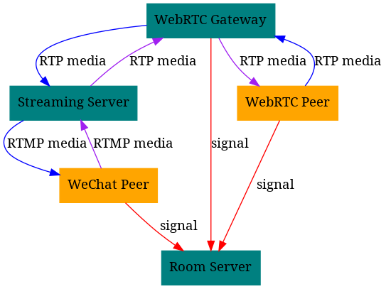
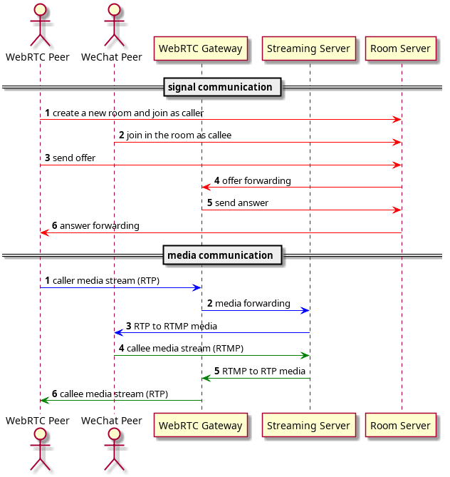
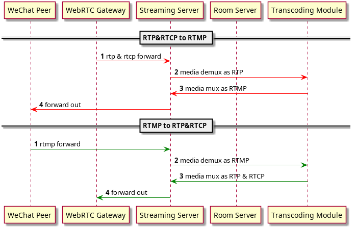

+++
title = "WebRTC 与微信小程序的音视频互通"
description = "WebRTC 与微信小程序的音视频互通"
date = 2019-04-19T15:35:56+08:00
draft = false
template = "page.html"
[taxonomies]
categories =  ["Streaming"]
tags = ["WebRTC", "RTMP", "wechat", "live-pusher", "live-player"]
+++

本文主要介绍我们打通 [WebRTC][webrtc] 端和微信小程序端的音视频互通方案，实现在尽量不需要改动 [WebRTC][webrtc] 端代码的情况下，添加对主叫和被叫微信小程序端的支持。

<!-- more -->

# 背景

考虑到腾讯微信的小程序平台提供了音视频的支持，如果能打通基于 [WebRTC][webrtc] 的实时音视频通话与微信小程序，就能够极大地扩展音视频的能力范围，为业务线的产品和服务提供更多更好的选择。

本文主要介绍我们打通 [WebRTC][webrtc] 端和微信小程序端的音视频互通方案，实现在尽量不需要改动 [WebRTC][webrtc] 端代码的情况下，添加对主叫和被叫微信小程序端的支持。

# 基于 WebRTC 的实时音视频方案

我们使用网络上开源的 [WebRTC][webrtc] 的方案部署了实时音视频支撑系统，能够支持多端（iOS/Android/Web）之间的音视频会话。其通过后端的 Room Server 服务来管理会话；某端需要发起音视频会话，首先需要到 Room Server 中注册一个房间，之后基于房间来进行信令的交互；主叫端和被叫端的音视频数据传输通过 [PeerConnection][peerconnection] 进行。

[WebRTC][webrtc] 端的媒体流方案是采用标准的 [RTP][rtp] 和 [RTCP][rtcp] 协议。

# 微信小程序的音视频支持

微信的小程序对外开放了 [音视频直播](https://cloud.tencent.com/document/product/454/12517) 的能力，使用方可以通过 [live-pusher][livepusher] 标签实现基于 [RTMP][rtmp] 的音视频推流（录制），[live-player][liveplayer] 标签实现基于 [RTMP][rtmp] 的音视频拉流（播放）。

- 微信 App iOS 最低版本要求：6.5.21
- 微信 App Android 最低版本要求：6.5.19
- 小程序基础库最低版本要求：1.7.0

微信小程序的音视频方案是基于 [RTMP][rtmp] 流媒体协议的。

# 互通方案

## 总体架构

方案的总体架构如下：

1. Janus Server 作为一个特殊的 [WebRTC][webrtc] 端与指定的另一个 [WebRTC][webrtc] 端通过 Room Server 交换信令并建立会话
2. 会话建立后，[WebRTC][webrtc] 端与 Janus Server 直接（P2P）或间接（[TURN][turn]）交换音视频流
3. Janus Server 将 [WebRTC][webrtc] 端之音视频流经 Streaming Server 转发至微信小程序端；微信小程序音视频输入流经 Streaming Server 转发至 [WebRTC][webrtc] 端

其中，Janus Server 使用 [Janus](https://janus.conf.meetecho.com) 来搭建，主要作为微信小程序端的 [WebRTC][webrtc] 代理辅助微信小程序端参与 [WebRTC][webrtc] 的会话，主要进行信令的沟通、[Offer/Answer][offeranswer] 的协商和媒体流数据的转发；Streaming Server 使用 [FFmpeg][ffmpeg] 和 [nginx-rtmp-module][nginx-rtmp-module] 来搭建，主要提供 [RTP][rtp] & [RTCP][rtcp] 媒体流和 [RTMP][rtmp] 媒体流数据的转换和中继；在已有的 Room Server 上扩展，添加了与接入微信小程序端相关的信令处理逻辑。

## 会话建立

需要支持 [WebRTC][webrtc] 端与微信小程序端的音视频流的互通，首先需要添加对其建立会话的支持；[WebRTC][webrtc] 端与微信小程序端的会话建立，具体来说是指：

1. [WebRTC][webrtc] 音视频(主叫) 与 微信小程序音视频(被叫)
2. [WebRTC][webrtc] 音视频(被叫) 与 微信小程序音视频(主叫)
3. [WebRTC][webrtc] 音视频(主叫) 与 [WebRTC][webrtc] 音视频(被叫)
4. 微信小程序音视频(主叫) 与 微信小程序音视频(被叫)

其中，case 3 和 case 4 不会涉及到 [WebRTC][webrtc] 端与微信小程序端的交互：case 3 由 [WebRTC][webrtc] 支持；case 4 由 [RTMP][rtmp] 中继方案可解决。

基于 [WebRTC][webrtc] 音视频和微信小程序音视频的互通方案，需要能支持 case 1 和 case 2。由于 [WebRTC][webrtc] 端需要信令交互，所以需要分别讨论这两种情况。

### WebRTC 音视频(主叫) 与 微信小程序音视频(被叫)

在此 case 中，Janus Server 以被叫的身份与 [WebRTC][webrtc] 端建立标准 [WebRTC][webrtc] 会话。

1. [WebRTC][webrtc] 端首先初始化房间
2. [WebRTC][webrtc] 端加入房间
3. 微信小程序端加入房间：Room Server 中添加了新的信令类型支持微信小程序以被叫的方式接入；此信令的处理过程中，回调 Janus Server 和 Streaming Server 进行资源初始化准备
4. [WebRTC][webrtc] 端发送 Offer 至 Room Server
5. Room Server 接收到 Offer 之后，将该 Offer 信息转发至 Janus Server；Janus Server 需要响应该 Offer，如果正常的话应该返回一个 Answer 至 Room Server；Room Server 转发 Answer 至 [WebRTC][webrtc] 端
6. 进入 [ICE][ice] 协商和连接建立流程

此 case下，Janus Server 作为微信小程序端的 [WebRTC][webrtc] 代理接入标准 [WebRTC][webrtc] 栈，复用已有的 [WebRTC][webrtc] 协议栈基础设施（[STUN][stun]/[TURN][turn]/[ICE][ice]/[SDP][sdp]），以减少对原 [WebRTC][webrtc] 栈的侵入影响。

### WebRTC 音视频(被叫) 与 微信小程序音视频(主叫)

在此 case 中，Janus Server 需要以主叫的身份与 [WebRTC][webrtc] 端建立标准 [WebRTC][webrtc] 会话。

1. 微信小程序端首先初始化房间
2. 微信小程序端加入房间：Room Server 中添加了新的信令类型支持微信小程序以主叫的方式接入；此信令的处理过程中，回调 Janus Server 和 Streaming Server 进行资源初始化准备
3. [WebRTC][webrtc] 端加入房间
4. Janus Server 生成固定 Offer，发送至 Room Server
5. Room Server 接收到 Offer 之后，将该 Offer 信息转发至 [WebRTC][webrtc] 端；[WebRTC][webrtc] 端需要响应该 Offer，如果正常的话应该返回一个 Answer 至 Room Server；Room Server 转发 Answer 至 Janus Server
6. 进入 [ICE][ice] 协商和连接建立流程

此 case 下，Janus Server 作为微信小程序端的 [WebRTC][webrtc] 代理接入标准 [WebRTC][webrtc] 栈，复用已有的 [WebRTC][webrtc] 协议栈基础设施（[STUN][stun]/[TURN][turn]/[ICE][ice]/[SDP][sdp]），以减少对原 [WebRTC][webrtc] 栈的侵入影响。

此 case 与前一个 case 的区别在于 [SDP][sdp] 信息（[Offer/Answer][offeranswer]）的生成和处理。微信小程序端主叫时，由于微信小程序端不能正常参与到 [WebRTC][webrtc] 栈的协议协商过程中来，需要在生成 Offer 时做一些针对性的优化和处理。

## 媒体流交换

由于 [WebRTC][webrtc] 端和微信小程序端分别是用不同的媒体协议：[WebRTC][webrtc] 端使用 [RTP][rtp] & [RTCP][rtcp] ；微信小程序端使用 [RTMP][rtmp]，因此采用了Janus Server 转发 [RTP][rtp] 流和 Streaming Server 居中转换的方案。

### RTP 转发

[RTP][rtp] 转发即是将 Janus Server 作为微信小程序端的 [WebRTC][webrtc] 代理，在通话过程中，将 [WebRTC][webrtc] 端上传的的 [RTP][rtp] 媒体流转发至 Streaming Server，同时将微信小程序端上传的经 Streaming Server 转换过的 [RTP][rtp] 流转发至 [WebRTC][webrtc] 端。

具体实现基于 Janus 的扩展机制：为每一通会话预分配两组音视频端口 *A* & *B* ，并:

1. 收到 [WebRTC][webrtc] 端的媒体数据后转发至音视频端口 *A*
2. 收到音视频端口 *B* 的媒体数据后转发至 [WebRTC][webrtc] 端

其中，音视频端口 *A* 转发的是 [WebRTC][webrtc] 端发向微信小程序端的媒体流，由 Streaming Server 监听；音视频端口 *B* 收到的是微信小程序端发向 [WebRTC][webrtc] 端的媒体流，来源是 Streaming Server，由 Janus Server 监听。

## 流媒体格式转换

Streaming Server 将 Janus Server 转发的 [RTP][rtp] & [RTCP][rtcp] 流转换为 [RTMP][rtmp] 流输出至微信小程序端，也将微信小程序端上传的 [RTMP][rtmp] 流转为 [RTP][rtp] & [RTCP][rtcp] 流输出至 Janus Server；最初的实现使用 [FFmpeg][ffmpeg] 搭建，[FFmpeg][ffmpeg] 可以很好地支持 [RTP][rtp] & [RTCP][rtcp] 与 [RTMP][rtmp] 的双向转换。

具体来说，即：

1. 将 [RTP][rtp] & [RTCP][rtcp] 的媒体封包格式转为 [RTMP][rtmp] 的封包格式，反之亦然
2. 将 [RTP][rtp] & [RTCP][rtcp] 中的视频（H264/vp8/vp9）转为 [RTMP][rtmp] 支持的 H264 ，反之亦然
2. 将 [RTP][rtp] & [RTCP][rtcp] 中的音频（opus）转为 [RTMP][rtmp] 支持的 aac ，反之亦然

## 中转流程优化

在实际使用过程中，发现流媒体中转服务的 [FFmpeg][ffmpeg] 处理过程中可以进行优化：Janus Server 转发的 [RTP][rtp] & [RTCP][rtcp] 流中的视频编码格式可以为 H264/VP8/VP9 等，具体格式由协商决定；微信小程序端支持的 [RTMP][rtmp] 中可用的视频流编码格式为 H264 ；如果能够限制 [WebRTC][webrtc] 端使用的视频编码格式为 H264 ，可以优化为只解包不解码，减少视频编解码耗时。

基于以上分析，本文对中转流程进行了重构，限制会话使用 H264 编码传输视频数据，并使用自研的 H264 裸流编解包代码替换 [FFmpeg][ffmpeg] 进行音视频流中转。实现微信小程序端通话时延从基于 [FFmpeg][ffmpeg] 时的 1-5s 优化到 500ms-1s，效果明显。

实现细节如下：

1. 修改 Janus Server 的 [SDP][sdp] 响应机制，在生成 Offer 或者响应 Answer 时只返回 H264 的视频协商信息。由于我们的 [WebRTC][webrtc] 端保证肯定支持 H264 ，所以不会导致协商失败
2. 解析带 H264 数据的 [RTP][rtp] 报文之后直接包装成 [RTMP][rtmp] 报文发出，不进行编解码操作和视频帧操作
3. 音频数据使用 [Libavformat](http://ffmpeg.org/libavformat.html) 转换。由于音频数据量小，不会对通话时延造成明显影响

## RTMP 首帧优化

微信小程序端与 Streaming Server 之间通过 [RTMP][rtmp] 传输音视频数据，在通话开始时可能会有多于 2s 的黑屏现象。这是由于微信小程序端在显示视频流时需要根据 H264 流中的 [IDR][idr] 帧的数据进行绘制，如果微信小程序端在建立连接时刻附近没有可用的 [IDR][idr] 帧数据，播放器会进行等待，出现黑屏。

基于以上分析，本文改造 [nginx-rtmp-module][nginx-rtmp-module]，在推流就绪而拉流未就绪时会开始缓存数据帧，缓存的数据帧包含最新一帧 [IDR][idr] 帧及其后的所有数据帧。在拉流就绪之前，新的非 [IDR][idr] 帧持续加入缓冲队列，新的 [IDR][idr] 帧重建缓重队列；在拉流就绪之后，使用已有逻辑，拉流消费推流生产的数据流。实现微信小程序端通话建立时延从之前的 2-3s 优化到 1-1.5s，效果明显。

## 会话保持

在会话的过程中，由于参与者多，数据链路比较复杂，本文采取了以下策略实现错误恢复和通话保持。

1. Janus Server 作为 [WebRTC][webrtc] 代理人，需要在整通会话中保持可用；如果不可用，Room Server 会使当前会话失败，并将该服务器从可用的列表中删去。可用性的检测目前是在 Room Server 中使用 WebSocket 保持心跳实现的
2. Streaming Server 作为中转服务维持着双向的媒体流，需要在整通会话中保持可用；如果不可用，Room Server 会使当前会话失败，并将该服务器从可用的列表中删去。可用性的检测是在 Room Server 中通过 RPC 服务周期性轮循检测实现的
3. Streaming Server 在单通会话中会保持双向的媒体流，其任一媒体流失败的概率都较高，因此实现了失败重试逻辑；由于媒体流是有状态的，在多服务器部署环境下，重试任务时能根据服务器进行隔离

出现错误或不可用的情况下，当前的通话会受到影响，在几秒钟内会被关闭；后续的新通话不会受到影响。

# 总结

本文所述的是一个打通 [WebRTC][webrtc] 和微信小程序的音视频通话支持方案。按照本方案，我们完成了原型系统的搭建，基本实现了预期的目标；后续需要不断优化结构，提高通话体验。

[webrtc]: https://en.wikipedia.org/wiki/WebRTC "WebRTC (Web Real-Time Communication)"
[peerconnection]: https://developer.mozilla.org/zh-CN/docs/Web/API/RTCPeerConnection "RTCPeerConnection"
[rtmp]: https://en.wikipedia.org/wiki/Real-Time_Messaging_Protocol "Real-Time_Messaging_Protocol"
[rtp]: https://en.wikipedia.org/wiki/Real-time_Transport_Protocol "Real-time_Transport_Protocol"
[rtcp]: https://en.wikipedia.org/wiki/RTP_Control_Protocol "RTP_Control_Protocol"
[livepusher]: https://developers.weixin.qq.com/miniprogram/dev/component/live-pusher.html
[liveplayer]: https://developers.weixin.qq.com/miniprogram/dev/component/live-player.html
[offeranswer]: https://tools.ietf.org/html/rfc3264 "An Offer/Answer Model with the Session Description Protocol (SDP)"
[ffmpeg]: https://ffmpeg.org "FFmpeg - A complete, cross-platform solution to record, convert and stream audio and video"
[ice]: https://tools.ietf.org/html/rfc5245 "Interactive Connectivity Establishment (ICE): A Protocol for Network Address Translator (NAT) Traversal for Offer/Answer Protocols"
[stun]: https://tools.ietf.org/html/rfc5389 "Session Traversal Utilities for NAT (STUN)"
[turn]: https://tools.ietf.org/html/rfc5766 "Traversal Using Relays around NAT (TURN): Relay Extensions to Session Traversal Utilities for NAT (STUN)"
[sdp]: https://tools.ietf.org/html/rfc4566 "SDP: Session Description Protocol"
[idr]: https://en.wikipedia.org/wiki/Network_Abstraction_Layer#Coded_Video_Sequences
[nginx-rtmp-module]: https://github.com/arut/nginx-rtmp-module "NGINX-based Media Streaming Server"
