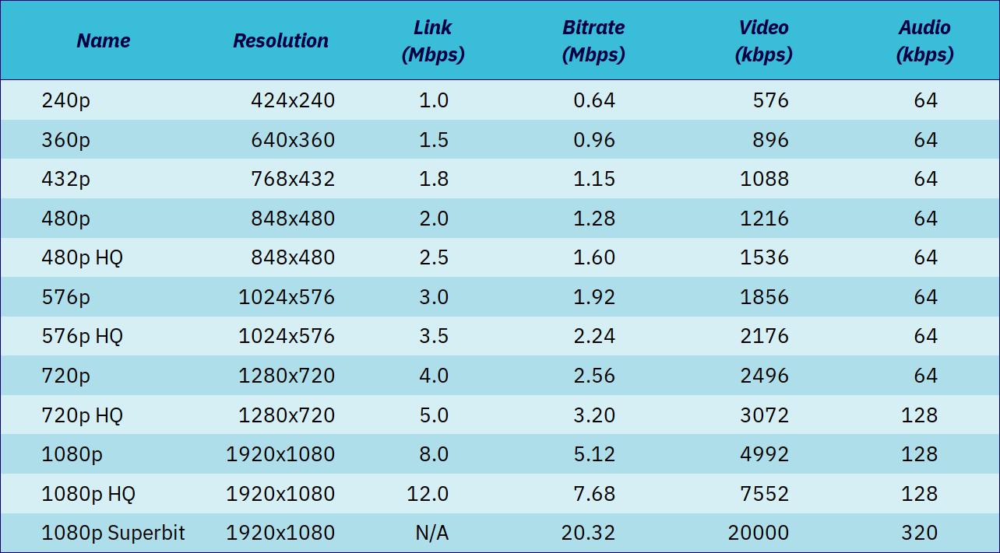
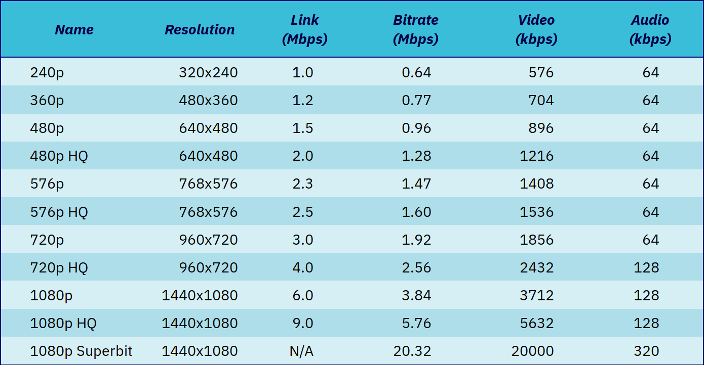

+++
title = "[Note] General Video Bitrate Recommendation"
description = "在视频转码的过程中，比较关键的是需要确定目标码率（或最大码率）。在网上找了一下大型互联网公司的推荐标准，聊为参考。"
date = 2019-07-08T10:48:41+08:00
draft = false
template = "page.html"
[taxonomies]
categories =  ["Streaming"]
tags = ["bitrate", "youtube", "apple"]
+++

在视频转码的过程中，比较关键的是需要确定目标码率（或最大码率）。

在网上找了一下大型互联网公司的推荐标准，聊为参考。

- [YouTube](#youtube)
- [Apple](#apple)
- [阿里云云栖社区博客](#a-li-yun-yun-qi-she-qu-mou-bo-ke)

<!-- more -->

# YouTube

[Recommended upload encoding settings](https://support.google.com/youtube/answer/1722171?hl=en)

- Recommended video bitrates for SDR uploads

| Type      | Video Bitrate Standard Frame Rate (24, 25,30) | Video Bitrate High Frame Rate (48,50,60) |
|-----------|-----------------------------------------------|------------------------------------------|
| 2160p(4k) | 35-45 Mbps                                    | 53-68 Mbps                               |
| 1440p(2k) | 16 Mbps                                       | 24 Mbps                                  |
| 1080p     | 8 Mbps                                        | 12 Mbps                                  |
| 720p      | 5 Mbps                                        | 7.5 Mbps                                 |
| 480p      | 2.5 Mbps                                      | 4 Mbps                                   |
| 360p      | 1 Mbps                                        | 1.5 Mbps                                 |

- Recommended video bitrates for HDR uploads

| Type      | Video Bitrate Standard Frame Rate (24, 25,30) | Video Bitrate High Frame Rate (48,50,60) |
|-----------|-----------------------------------------------|------------------------------------------|
| 2160p(4k) | 44-56 Mbps                                    | 66-85 Mbps                               |
| 1440p(2k) | 20 Mbps                                       | 30 Mbps                                  |
| 1080p     | 10 Mbps                                       | 15 Mbps                                  |
| 720p      | 6.5 Mbps                                      | 9.5 Mbps                                 |
| 480p      | Not supported                                 | Not supported                            |
| 360p      | Not supported                                 | Not supported                            |

在翻墙不便的情况下，可以参考图片(PNG)版本。

或者 PDF 版本。

[Recommended upload encoding settings (PDF)](bitrate_by_youtube.pdf)

# Apple

[HLS Authoring Specification for Apple Devices](https://developer.apple.com/documentation/http_live_streaming/hls_authoring_specification_for_apple_devices)

- Video average bit rate (kb/s)

| 16:9 aspect ratio | H.264/AVC | Frame rate                  |
|-------------------|-----------|-----------------------------|
| 416 x 234         | 145       | &#8804; 30 fps |
| 640 x 360         | 365       | &#8804; 30 fps |
| 768 x 432         | 730       | &#8804; 30 fps |
| 768 x 432         | 1100      | &#8804; 30 fps |
| 960 x 540         | 2000      | same as source              |
| 1280 x 720        | 3000      | same as source              |
| 1280 x 720        | 4500      | same as source              |
| 1920 x 1080       | 6000      | same as source              |
| 1920 x 1080       | 7800      | same as source              |

在翻墙不便的情况下，可以参考图片(PNG)版本。

或者 PDF 版本。

[HLS Authoring Specification for Apple Devices (PDF)](bitrate_by_apple.pdf)

# Others

## 阿里云云栖社区某博客

[阿里云云栖社区博客 - H.264 码率设置](https://yq.aliyun.com/articles/243467)

| 视频大小 | 分辨率      | 推荐码率  |
|----------|-------------|-----------|
| 480P     | 720 x 480   | 1800 Kbps |
| 720P     | 1280 x 720  | 3500 Kbps |
| 1080P    | 1920 x 1080 | 8500 Kbps |

## Lighterra

| Name           | Resolution | Link  (Mbps) | Bitrate (Mbps) | Video (kbps) | Audio (kbps) |
|----------------|------------|--------------|----------------|--------------|--------------|
| 240p           | 320 x240   | 1.0          | 0.64           | 576          | 64           |
| 240p           | 424 x240   | 1.0          | 0.64           | 576          | 64           |
| 360p           | 480 x360   | 1.2          | 0.77           | 704          | 64           |
| 360p           | 640 x360   | 1.5          | 0.96           | 896          | 64           |
| 432p           | 768 x432   | 1.8          | 1.15           | 1088         | 64           |
| 480p           | 640 x480   | 1.5          | 0.96           | 896          | 64           |
| 480p           | 848 x480   | 2.0          | 1.28           | 1216         | 64           |
| 480p HQ        | 640 x480   | 2.0          | 1.28           | 1216         | 64           |
| 480p HQ        | 848 x480   | 2.5          | 1.60           | 1536         | 64           |
| 576p           | 768 x576   | 2.3          | 1.47           | 1408         | 64           |
| 576p           | 1024 x576  | 3.0          | 1.92           | 1856         | 64           |
| 576p HQ        | 768 x576   | 2.5          | 1.60           | 1536         | 64           |
| 576p HQ        | 1024 x576  | 3.5          | 2.24           | 2176         | 64           |
| 720p           | 960 x720   | 3.0          | 1.92           | 1856         | 64           |
| 720p           | 1280 x720  | 4.0          | 2.56           | 2496         | 64           |
| 720p HQ        | 960 x720   | 4.0          | 2.56           | 2432         | 128          |
| 720p HQ        | 1280 x720  | 5.0          | 3.20           | 3072         | 128          |
| 1080p          | 1440 x1080 | 6.0          | 3.84           | 3712         | 128          |
| 1080p          | 1920 x1080 | 8.0          | 5.12           | 4992         | 128          |
| 1080p HQ       | 1440 x1080 | 9.0          | 5.76           | 5632         | 128          |
| 1080p HQ       | 1920 x1080 | 12.0         | 7.68           | 7552         | 128          |
| 1080p Superbit | 1440 x1080 | N/A          | 20.32          | 20000        | 320          |
| 1080p Superbit | 1920 x1080 | N/A          | 20.32          | 20000        | 320          |

截图备份：

参见 [Video Encoding Settings for H.264 Excellence](http://www.lighterra.com/papers/videoencodingh264/) 。

---

以上。
