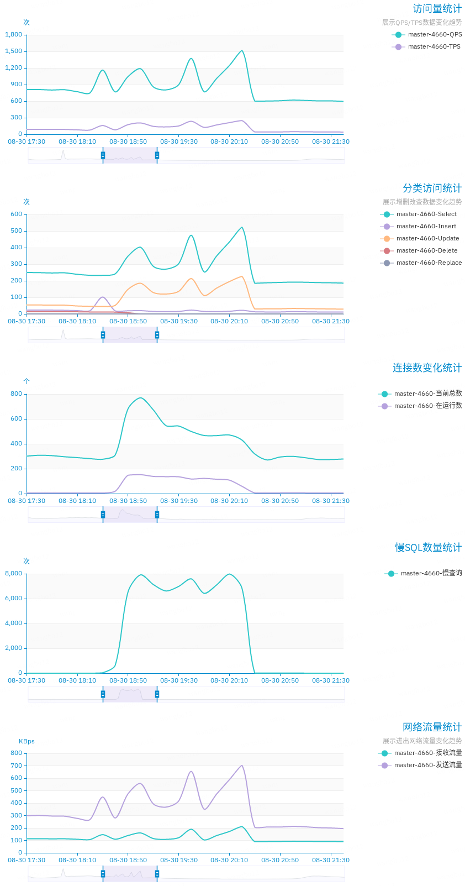
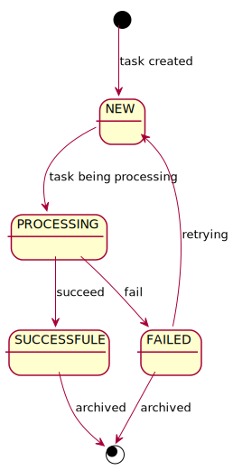
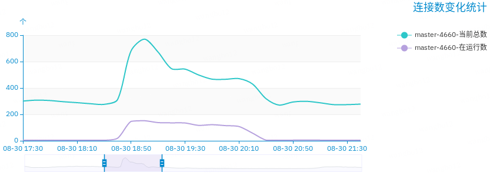
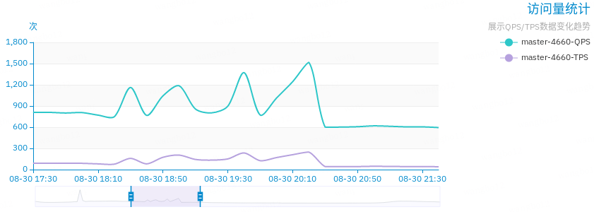
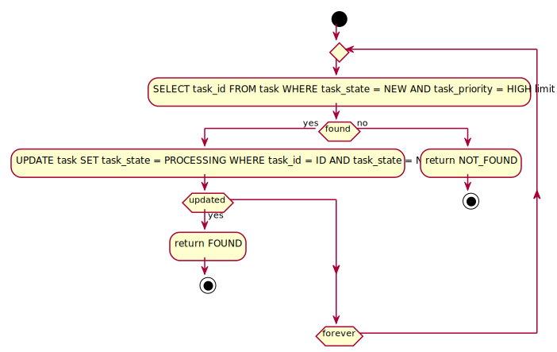

+++
title = "一次由于线上 MySQL 并发抢占更新冲突引发的 BUG"
description = "前几天在处理线上问题的时候，发现了一个由于多客户端并发使用 CAS 去更新相同记录而导致的锁冲突，引发了数据库管理系统的慢查询累积报警。慢查询导致连接数增加，并引起插入和更新操作被堵塞，引起少量的业务堆积。"
date = 2019-08-31T11:30:40+08:00
draft = false
template = "page.html"
[taxonomies]
categories =  ["Practise"]
tags = ["mysql", "cas", "lock"]
+++

前几天在处理线上问题的时候，发现了一个由于多客户端并发使用 CAS 去更新相同记录而导致的锁冲突，引发了数据库管理系统的慢查询累积报警。慢查询导致连接数增加，并引起插入和更新操作被堵塞，引起少量的业务堆积。

一图胜千言。



虽然定位并解决了问题，但还是需要事后总结一下，以资后鉴。

<!-- more -->

# 系统概览

目标系统是一个离线的准实时任务处理系统。专门的一个服务收集任务并写入到 MySQL 中，多台服务器通过轮循的方式从 MySQL 中接受任务并处理。

任务表结构类似于：

| Field Name       | Type   | Description                                |
|------------------|--------|--------------------------------------------|
| task_id          | bigint | 任务 ID                                    |
| task_state       | int    | 任务状态：NEW PROCESSING SUCCESSFUL FAILED |
| task_priority    | int    | 任务优先级：NORMAL HIGH LOW                |
| insert_time      | bigint | 插入时间戳                                 |
| last_update_time | bigint | 最近更新时间戳                             |

任务插入的时候状态(task_state)会被置为 "NEW"；任务处理的服务器会根据一些策略选择未处理的任务进行处理；正在处理的任务状态被更新为 "PROCESSING"；处理完任务的状态为 "SUCCESSFUL" 或 "FAILED"。



客户端会优先处理优先级高的任务，然后处理优先级低的任务。

# 事件回顾

根据业务线的需求，系统需要批量导入数万的任务进行处理。

通过服务接口将需导入的任务插入 MySQL 之后，任务处理服务器按照预期地拉去任务进行处理。

大约 15 分钟以后，收到第一条数据库管理系统的慢查询累积报警。数据库管理系统所称的慢查询是指执行时间超过 100 ms 的 SQL 执行语句。

通过在管理系统上查看，发现确实出现了处理时间最大 7 s 的操作；耗时超过 100 ms 的 SQL 中有 SELECT 语句，也有 UPDATE 语句。


慢查询数量快速上涨，并在高位波动。

大量的慢查询累积，导致客户端的请求无法快速被响应，使得新的请求需要创建新的连接，最终表现为服务器的连接数上升。



总的连接数也是快速上涨，但是波动不明显。总连接数 700 左右，按照总共 100 个客户端来计算的话，每个客户端需要 7 个连接。

于此同时，图表显示数据库的请求量都异常增长，而且数量随着慢查询的波动而变化。


但是完成的事务量增长较小，没有异常变化。



# 问题排查与分析

从请求量的变化上可以看到，变化明显的是 SELECT 和 UPDATE 的请求量。观察 MySQL 的日志，发现慢查询最多的两条 SQL 分别是用来查询当前需要处理的任务 ID 和尝试更新任务状态为 "PROCESSING" 。

1. `SELECT task_id FROM task WHERE task_state = NEW AND task_priority = HIGH limit 1;`
2. `UPDATE task SET task_state = PROCESSING WHERE task_id = ID AND task_state = NEW;`

考虑当前的任务获取的逻辑：



可以很快发现问题出在了客户端试图去更新任务状态为 "PROCESSING" 这一步：如果同时有多个客户端试图更新同
一个任务的状态，则其他的所有后续的客户端都必须等待第一个加锁的客户端处理完成之后才能继续处理；由于第
一个客户端成功地将状态修改为了 "PROCESSING"，则所有后续的客户端都会无法完成自己的目标，导致全部进入
了对下一个任务的相同操作逻辑里；这就产生了 CAS 冲突，如果任务数很大，而且客户端比较多的场景下，就会
导致频繁的锁冲突。

临时的解决方案是：每个客户端在更新状态失败以后，随机地等待一段时间。每个客户端随机等待的时间错开之后
，冲突的客户端连续多次 CAS 冲突的概率极低。

根据临时方案修改上线之后，服务恢复了正常。

# 拓展

## AtomicLong

JDK 的 `AtomicLong` 类里面大量使用了 CAS 的技巧，如：

```java
public final long getAndUpdate(LongUnaryOperator updateFunction) {
	long prev, next;
	do {
		prev = get();
		next = updateFunction.applyAsLong(prev);
	} while (!compareAndSet(prev, next));
	return prev;
}
```

在多线程环境中使用该方法，也会遇到类似的 CAS 冲突的问题：多个线程自旋地竞争同一个资源，都无法顺利地实现自己的更新逻辑。

一个比较好的替代是 JDK 1.8 以后的 `LongAdded` 类，其使用了空间换时间的思路，使用一个额外的数组空间来存储附加值，使得在多线程竞争发生时把不同线程的修改分散到不同的数组元素上，从而避免空自旋。

## 乐观变悲观

HotSpot JDK 对锁的优化里面有一项是重量级锁优化为轻量级锁，在轻量级锁加锁失败一定次数之后再升级到重量级锁，可以避免在高并发时大量无效的空自旋，同时能保证在低并发时的性能。

如果检测到竞争发生，可以在一定次数的失败之后，尝试使用悲观锁进行资源的获取。

## 主动停止竞争

如果检测到竞争发生，可以主动暂停操作让出资源，等待一段时间之后再进行自己的操作。等待的时间需要特别留意避免后续冲突，可以使用随机的等待时间尽量降低冲突概率。

## 改变目标对象

另外一种思路是，当冲突出现，竞争的客户端可以下一步去尝试更新距离目标任务最近的若干个任务里面的随机的一个。这样也能降低冲突的概率。

## 拉模式与推模式

在特定的场景下，可以考虑重构业务模型，不使用客户端定时轮循的方式，而使用生产者主动发布任务的模式。如果生产者能够获得所有的客户端的列表，可以自由选择任务的目标客户端；这样带来的附加收益是生产者可以使用灵活的负载均衡策略和任务调度策略。

# 总结

目前的临时解决方式是主动睡眠一个随机的时间，到期之后再去尝试接收任务。

一个比较合适的长期解决方案是使用推模式来进行任务的消费：客户端不需要主动轮循 MySQL，而是建立到一个任务分派者的连接；任务分派者轮循 MySQL，取出任务分发给其中的一个客户端；客户端的选择策略可以使用通用的随机算法或 Round-Robin 算法，也可以根据各客户端的处理能力和负载情况来动态确定。

以上。
