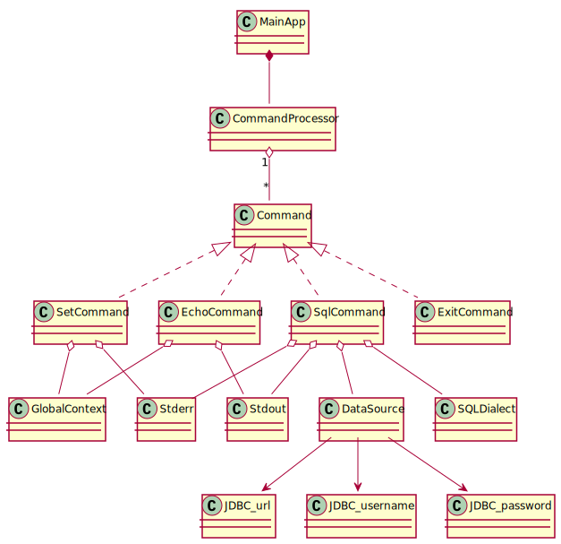

+++
title = "Dependency Injection - Guice VS Dagger 2"
description = "做 Java 后台开发的同学，基本上都使用过 Dependency Injection 依赖注入框架。大名鼎鼎的 Spring Framework 就是从依赖注入起家的，然后一路奔向了全家桶的不归路；Guice 是 Google 公司的依赖注入解决方案，重视类型安全胜过于使用便利性，相比 Spring Framework 能提供更精准的控制和更翔实的注入失败错误信息；而由 Google 接盘 Square 的 Dagger 2 则比 Guice 更进一步，通过在编译时构建依赖注入关系，使得依赖错误在编译阶段尽量暴露出来，同时，原生类型安全的 Java 代码相较基于反射的注入代码也有或多或少的性能提升（尤其是在 Android 上）。本文通过同时使用 Guice 和 Dagger 2 来实现相同的功能，对比二者在实现依赖注入方法上的异同。"
date = 2019-10-30T15:49:49+08:00
draft = false
template = "page.html"
[taxonomies]
categories =  ["Java"]
tags = ["jsr330", "inject", "guice", "dagger2"]
+++

做 Java 后台开发的同学，基本上都使用过 [Dependency Injection][di] 依赖注入框架。大名鼎鼎的 [Spring
Framework][spring] 就是从依赖注入起家的，然后一路奔向了全家桶的不归路；[Guice][guice] 是
Google 公司的依赖注入解决方案，重视类型安全胜过于使用便利性，相比 [Spring Framework][spring] 能提供
更精准的控制和更翔实的注入失败错误信息；而由 Google 接盘 [Square](http://square.github.io/) 的
[Dagger 2][dagger] 则比 [Guice][guice] 更进一步，通过在编译时构建依赖注入关系，使得依赖错误在编译阶
段尽量暴露出来，同时，原生类型安全的 Java 代码相较基于反射的注入代码也有或多或少的性能提升（尤其是在
Android 上）。

本文通过同时使用 [Guice][guice] 和 [Dagger 2][dagger] 来实现相同的功能，对比二者在实现依赖注入方法上
的异同。

<!-- more -->

# Overview

从 [Dagger Tutorial][dt] 得到的灵感，分别使用 [Guice][guice] 和 [Dagger 2][dagger] 来实现一个实用工
具模拟程序。程序的功能很简单：启动后读取输入并解析，执行能够识别的子命令；支持的子命令暂时包括
`exit`/`set`/`echo`/`sql`。

- 每一行的输入按空白符解析为一个字符串数组
- 字符串数组中的第一个元素是子命令的类型
- 字符串数组中的其他元素是子命令的参数

其中，

- `exit` 直接退出程序
- `set` 可以设置指定名称变量的值
- `echo` 回显所有输入的参数，能够解析以 `$` 开头的变量解析
- `sql` 对固定的数据库实例执行 SQL，实践中使用了 H2 数据库

# JSR 330

[JSR 330 (javax.inject)][jsr330] 是 Java EE (更名为 Jakarta EE) 开发的依赖注入规范，[Spring
Framework][spring]、[Google Guice][guice] 和 [Dagger 2][dagger] 都（部分）实现了 [JSR 330][jsr330]
规范。

在 `pom.xml` 文件中添加以下依赖项：

```xml
<dependency>
    <groupId>javax.inject</groupId>
    <artifactId>javax.inject</artifactId>
    <version>1</version>
</dependency>
```

[JSR 330][jsr330] 引入了 5 个注解类和 1 个接口类：

1. `@javax.inject.Inject` 可以标记于构造函数、实例方法和属性字段，用于说明该构造函数、实例方法和属性字段是可注入的 (injectable)。“可注入的”说明依赖注入框架在处理该构造函数、实例方法和属性字段时需要自动解析依赖，这包含两层意思：一是构造函数、实例方法的参数、属性字段等变量赋值操作由依赖注入框架执行，二是这些依赖项实例的构造、维护和管理都应有依赖注入框架负责。“可注入的”构造函数同时也表明，如果该类被别的组件依赖时，依赖注入框架应该从这个构造函数构造和初始化该类的实例，这隐含了一个类中最多只能有一个“可注入的”构造函数。
2. `@javax.inject.Named` 用来给依赖项命名，是 `@javax.inject.Qualifier` 注解用法的一个特例。如果出现了两个或多个同类型的依赖项，依赖注入框架可以依据此注解根据不同的名称区分依赖。
3. `@javax.inject.Qualifier` 用来区分不同的依赖项。此注解主要用来设计新的注解；新的注解可以用于标识依赖的特征，不同新注解标记的相同类的实例是不同的依赖项。此注解派生出来的新注解与 `@javax.inject.Named` 注解的区别在于前者能提供类型安全的保证，后者只能通过字符串的相等性保证依赖的一致性。
4. `@javax.inject.Scope` 用来区分依赖项的不同的作用域和生命周期范围，其用法与 `@javax.inject.Qualifier` 相似，也是用来派生新的注解。
5. `@javax.inject.Singleton` 用来标识 **单例** 的作用域和生命周期范围，是 `@javax.inject.Scope` 注解用法的一个特例。
6. `javax.inject.Provider<T>` 是一个 **Supplier** 类型的接口，主要用于将依赖项实例的获取和类构造函数解耦。构造函数是 `javax.inject.Provider` 接口的一种特殊实现。

使用 [JSR 330][jsr330] 的注解和接口可以开发应用程序的主干逻辑，不同组件之间通过依赖项相互关联；依赖注入框架负责依赖项的构造、依赖图谱的维护和管理，以及向外（使用者）提供获取所管理实例对象的入口。

# App Structure

整个应用程序的结构设计如下：



`MainApp` 类是应用程序的入口，其主要逻辑是构造一个 `CommandProcessor` 类型的实例，并用该实例处理输入行。

```java
public class MainApp {
    public static void main(String[] args) {
        // TODO construct a valid CommandProcessor instance
        final CommandProcessor processor = null; // fixme

        final Scanner scanner = new Scanner(System.in);
        while (scanner.hasNextLine()) {
            final Status status = processor.process(scanner.nextLine());
            if (status.equals(Status.QUITING)) {
                break;
            }
        }
    }
}
```

`CommandProcessor` 类解析一个字符串为空白字符分隔的子串组，根据子串组的元素查询到对应的 `Command` 实例并将子串组代理到该实例进行处理。

```java
public class CommandProcessor {
    private final Map<String, Command> map;

    @Inject
    public CommandProcessor(final Map<String, Command> map) {
        this.map = map;
    }

    public Status process(final String line) {
        final List<String> args = splitByWhiteSpace(line);

        if (args.isEmpty()) {
            return Status.INVALID;
        }

        final String name = args.get(0);

        final Command cmd = map.get(name);
        if (cmd == null) {
            return Status.INVALID;
        }

        return cmd.handleInput(args.subList(1, args.size()));
    }

    private static List<String> splitByWhiteSpace(final String str) {
        return Arrays.asList(str.split("\\s+"));
    }
}
```

`CommandProcessor` 类的构造函数被标记了 `@javax.inject.Inject` 注解，说明其需要一个 `java.util.Map<String, Command>` 类型的依赖性，该依赖项需要由依赖注入框架提供。

`Command` 接口类很简单，主要提供处理子串组的逻辑入口。

```java
public interface Command {
    Status handleInput(final List<String> args);

    enum Status { INVALID, SUCCEED, FAILED, QUITING }
}
```

`ExitCommand`/`SetCommand`/`EchoCommand`/`SqlCommand` 类都是 `Command` 接口的实现，分别实现 `exit`/`set`/`echo`/`sql` 命令。

```java
final class ExitCommand implements Command {
    @Inject
    ExitCommand() {}

    @Override
    public Status handleInput(final List<String> args) {
        return Status.QUITING;
    }
}
```

`ExitCommand` 类不作任何具体处理，直接返回退出状态。

```java
final class SetCommand implements Command {
    private final Stderr stderr;
    private final GlobalContext ctx;

    @Inject
    SetCommand(final GlobalContext ctx, final Stderr stderr) {
        this.ctx = ctx;

        this.stderr = stderr;
    }

    @Override
    public Status handleInput(final List<String> args) {
        final int n = args.size();
        if (n != 2) {
            stderr.println("Usage: set name value");
            return Status.FAILED;
        }

        ctx.set(args.get(0), args.get(1));
        return Status.SUCCEED;
    }
}
```

`SetCommand` 类从输入参数中解析出键值对，并设置到一个注入的上下文对象中。

```java
final class EchoCommand implements Command {
    private final Stdout stdout;
    private final GlobalContext ctx;

    @Inject
    EchoCommand(final GlobalContext ctx, final Stdout stdout) {
        this.ctx = ctx;
        this.stdout = stdout;
    }

    @Override
    public Status handleInput(final List<String> args) {
        final int n = args.size();
        for (int i = 0; i < n - 1; i++) {
            stdout.print(ctx.resolve(args.get(i))).print(" ");
        }

        if (n > 0) {
            stdout.println(ctx.resolve(args.get(n - 1)));
        }
        return Status.SUCCEED;
    }
}
```

`EchoCommand` 类将输入参数原样输出，如果输入参数中有以 `$` 开头的则从注入的上下文对象中取出对应的值并输出。

```java
final class SqlCommand implements Command {
    private final Stdout stdout;
    private final Stderr stderr;

    private final SQLDialect dialect;
    private final DataSource dataSource;

    @Inject
    SqlCommand(final DataSource dataSource,
        final SQLDialect dialect,
        final Stdout stdout, final Stderr stderr) {

        this.dataSource = dataSource;
        this.dialect = dialect;

        this.stdout = stdout;
        this.stderr = stderr;
    }

    @Override
    public Status handleInput(final List<String> args) {
        final int n = args.size();
        if (n <= 1) {
            stderr.println("Usage: sql SQL-commands");
            return Status.FAILED;
        }

        final DSLContext dsl = DSL.using(dataSource, dialect);
        try {
            final int re = dsl.execute(String.join(" ", args));
            stdout.println("Return code: " + re);
            return Status.SUCCEED;
        } catch (DataAccessException ex) {
            stderr.println(ex.getMessage());
            return Status.FAILED;
        }
    }
}
```

`SqlCommand` 类使用注入的 `javax.sql.DataSource` 对象实例执行输入的 SQL 语句。

考虑到 JDBC 数据源的初始化需要 URL/用户名/密码 参数，使用 `SqlUtils` 类来存放辅助注入的代码。

```java
public final class SqlUtils {
    @Qualifier
    @Documented
    @Retention(RetentionPolicy.RUNTIME)
    @Target({ElementType.METHOD, ElementType.CONSTRUCTOR,
             ElementType.FIELD, ElementType.PARAMETER})
    public @interface JdbcUrl {}

    public static final String NAMED_KEY_JDBC_USERNAME = "jdbc_username";
    public static final String NAMED_KEY_JDBC_PASSWORD = "jdbc_password";
}
```

其中，`@JdbcUrl` 注解使用 `@javax.inject.Qualifier` 注解标记，用来辅助 JDBC URL 的注入；变量 `NAMED_KEY_JDBC_USERNAME` 和 `NAMED_KEY_JDBC_PASSWORD` 被设计用来配合 `@javax.inject.Named` 注解辅助 JDBC 用户名/密码的注入。

应用程序功能性文件组织结构如下：

```
├── app
│   ├── Command.java
│   ├── CommandProcessor.java
│   ├── GlobalContext.java
│   ├── Stderr.java
│   └── Stdout.java
├── echo
│   └── EchoCommand.java
├── exit
│   └── ExitCommand.java
├── set
│   └── SetCommand.java
├── sql
│   ├── SqlCommand.java
│   └── SqlUtils.java
└── MainApp.java
```

完整的示例代码可以参见 [Guice Usecases](https://github.com/wbprime/java-mods/tree/master/guice-usecases) 和 [Dagger Usecases](https://github.com/wbprime/java-mods/tree/master/dagger-usecases)。

应用程序的基本功能都已经实现了；接下来需要将所有的组件组装起来并向 `MainApp` 提供一个完整且可用的
`CommandProcessor` 实例，而这是依赖注入框架需要解决，且能体现出各自特点的部分了。

# DI via Guice

[Guice][guice] 官方编写了一个糊弄人的[入门手册](https://github.com/google/guice/wiki/GettingStarted)，如果对 [Guice][guice] 不熟悉的读完之后还没有入门的需要继续阅读 [WIki](https://github.com/google/guice/wiki) 上的其他文档。

简言之，[Guice][guice] 支持 [JSR 330][jsr330] 依赖注入模型，使用反射技术在运行时构建依赖关系图谱并实施依赖注入；对于复杂依赖项或未使用 `@javax.inject.Inject` 注解标识的依赖项可以使用其令人印象深刻的 Binding DSL 或标记了 `@com.google.inject.Provides` 注解的方法来显式指定。

本文中使用的 [Guice][guice] 的版本为 `4.2.2`，在 `pom.xml` 文件中配置如下：

```xml
<dependency>
    <groupId>com.google.inject</groupId>
    <artifactId>guice</artifactId>
    <version>${google_guice_version}</version>
</dependency>
<dependency>
    <groupId>com.google.inject.extensions</groupId>
    <artifactId>guice-multibindings</artifactId>
    <version>${google_guice_version}</version>
</dependency>
```

使用 [Guice][guice] 之后的项目文件结构如下：

```
├── app
│   ├── AppModule.java          # 新增加
│   ├── Command.java
│   ├── CommandProcessor.java
│   ├── GlobalContext.java
│   ├── Stderr.java
│   └── Stdout.java
├── echo
│   ├── EchoCommand.java
│   └── EchoModule.java         # 新增加
├── exit
│   ├── ExitCommand.java
│   └── ExitModule.java         # 新增加
├── set
│   ├── SetCommand.java
│   └── SetModule.java          # 新增加
├── sql
│   ├── SqlCommand.java
│   ├── SqlModule.java          # 新增加
│   └── SqlUtils.java
├── MainApp.java                # 修改
└── MainModule.java             # 新增加
```

一共需要增加六个类文件，和修改 `MainApp` 中生成 `CommandProcessor` 实例的代码。

新增加的 `AppModule` 类的内容如下：

```java
public final class AppModule extends AbstractModule {
    @Provides
    static Stdout providesStdout() {
        return new Stdout() {
            @Override
            public Stdout print(String str) {
                System.err.print(str);
                return this;
            }

            @Override
            public Stdout println(String str) {
                System.err.println(str);
                return this;
            }
        };
    }

    @Provides
    static Stderr providesStderr() {
        return new Stderr() {
            @Override
            public Stderr print(String str) {
                System.err.print(str);
                return this;
            }

            @Override
            public Stderr println(String str) {
                System.err.println(str);
                return this;
            }
        };
    }
}
```

可以看到 `AppModule` 类是一个普通类，里面的方法都是标记了 `@com.google.inject.Provides` 注解的静态方法，用于指示如何创建 `Stdout` 和 `Stderr` 接口的实现类实例；如果别的组件依赖了 `Stdout` 或 `Stderr` 接口实例，可以从 `AppModule` 中获取到如何生成对应实例的知识。

按照 [Guice][guice] 的规定，所有标记 `@com.google.inject.Provides` 注解的方法必须位于 `com.google.inject.Module` 接口的实现类中。所以 `AppModule` 类需要继承 `com.google.inject.AbstractModule` 类（类 `com.google.inject.AbstractModule` 是 `com.google.inject.Module` 接口的实现类）。

新增加的 `EchoModule` 类的内容如下：

```java
public final class EchoModule extends AbstractModule {
    @Override
    protected void configure() {
        final MapBinder<String, Command> binder = MapBinder.newMapBinder(
            binder(), String.class, Command.class
        );

        binder.addBinding("echo").to(EchoCommand.class);
    }
}
```

类似于 `AppModule` 类，类 `EchoModule` 也继承了 `com.google.inject.AbstractModule` 类。同时 `EchoModule` 类还实现了 `configure` 方法，在方法实现中使用了 Binding DSL 来创建生成 `java.util.Map<String, Command>` 依赖项的规则。[Guice][guice] 的 Binding DSL 非常灵活，而且强大。

类似 `EchoModule` 类，新增加的 `ExitModule` 类和 `SetModule` 类的内容如下：

```java
public final class ExitModule extends AbstractModule {
    @Override
    protected void configure() {
        final MapBinder<String, Command> binder = MapBinder.newMapBinder(
            binder(), String.class, Command.class
        );

        binder.addBinding("exit").to(ExitCommand.class);
    }
}

public class SetModule extends AbstractModule {
    @Override
    protected void configure() {
        final MapBinder<String, Command> binder = MapBinder.newMapBinder(
            binder(), String.class, Command.class
        );

        binder.addBinding("set").to(SetCommand.class);
    }
}
```

新增加的 `SqlModule` 类的内容如下：

```java
public final class SqlModule extends AbstractModule {
    @Override
    protected void configure() {
        final MapBinder<String, Command> binder = MapBinder.newMapBinder(
            binder(), String.class, Command.class
        );

        binder.addBinding("sql").to(SqlCommand.class);
    }

    @Provides
    private SQLDialect providesSqlDialect(@JdbcUrl final String url) {
        return JDBCUtils.dialect(url);
    }

    @Provides
    private DataSource providesDataSource(
        @JdbcUrl final String url,
        @Named(SqlUtils.NAMED_KEY_JDBC_USERNAME) final String username,
        @Named(SqlUtils.NAMED_KEY_JDBC_PASSWORD) final String pwd) {
        final HikariConfig config = new HikariConfig();
        config.setJdbcUrl(url);
        config.setUsername(username);
        config.setPassword(pwd);
        config.addDataSourceProperty("cachePrepStmts", "true");
        config.addDataSourceProperty("prepStmtCacheSize", "250");
        config.addDataSourceProperty("prepStmtCacheSqlLimit", "2048");

        return new HikariDataSource(config);
    }
}
```

`SqlModule` 类中多了两个标记了 `@com.google.inject.Provides` 注解的方法。这两个方法可以有额外的参数，参数的值是由依赖注入框架管理的。`@JdbcUrl` 注解用于将锁标记的依赖项与其他同类型(`java.lang.String`)的依赖项做区分；`@javax.inject.Named` 注解也是类似的作用。

新增加的 `MainModule` 类的内容如下：

```java
final class MainModule extends AbstractModule {
    private final String jdbcUrl;
    private final String jdbcUsername;
    private final String jdbcPwd;

    MainModule(final String url, final String username, final String pwd) {
        this.jdbcUrl = url;
        this.jdbcUsername = username;
        this.jdbcPwd = pwd;
    }

    @Override
    protected void configure() {
        bindConstant().annotatedWith(JdbcUrl.class).to(jdbcUrl);
        bindConstant().annotatedWith(Names.named(SqlUtils.NAMED_KEY_JDBC_USERNAME))
            .to(jdbcUsername);
        bindConstant().annotatedWith(Names.named(SqlUtils.NAMED_KEY_JDBC_PASSWORD))
            .to(jdbcPwd);

        install(new AppModule());
        install(new EchoModule());
        install(new SetModule());
        install(new ExitModule());
        install(new SqlModule());
    }
}
```

`MainModule` 类中有一个带三参数的构造函数，用于获取 JDBC 相关设置的值。在 `configure` 方法体中，首先将 JDBC 相关配置添加为依赖项，然后安装了(install)了以上的 `AppModule`/`EchoModule`/`SetModule`/`ExitModule`/`SqlModule` 类。这样从 `MainModule` 类就能获取所有所需的依赖项和依赖关系了。

在 `MainApp` 中需要从 `MainModule` 类构建 `com.google.inject.Injector` 实例并从中获取 `CommandProcessor` 实例，相关代码修改为：

```java
final Injector injector = Guice.createInjector(new MainModule(
    "jdbc:h2:mem:test", "h2", "user@H2"
));
final CommandProcessor processor = injector.getInstance(CommandProcessor.class);
```

这样就完成了应用程序的组装。完整的示例代码可以参见 [Guice Usecases](https://github.com/wbprime/java-mods/tree/master/guice-usecases) 。

说明：方案中为了保持部分实现类内容的包级别可用性，使用了多个 Module 类文件；如果不介意实现类的可见性，可以整个应用程序使用一个完整的 Module 类文件。

# DI via Dagger

[Dagger 2][dagger] 官方编写了一个非常棒的[入门手册][dt]，如果对 [Dagger 2][dagger] 不熟悉的可以先阅读该文档。

简言之，[Dagger 2][dagger] 支持 [JSR 330][jsr330] 依赖注入模型，使用 [Java 注解处理器 (Annotation Processing Tool, APT)][apt] 技术在编译时生成代码构建依赖注入模型；对于复杂依赖项或未使用 `@javax.inject.Inject` 注解标识的依赖项可以使用 Module 来显式指定；组件的组装和对外暴露需要使用 Component 来进行。

Module 是对负责提供依赖项的一组类的统称。根据 [Dagger 2][dagger] 的规范，一个 Module 类需要由 `@dagger.Module` 注解标记，类中包含返回值为非 `void` 的方法来指定依赖项的生成规则；这些方法可以是常规的、静态的或抽象的，可以有零个、一个或多个参数；这些方法需要按使用场景分别用 `@dagger.Provides` 注解、`@dagger.Binds` 注解或其他注解来标记。

Component 是对通过依赖项组装构造所需对象实例的一组类的统称。根据 [Dagger 2][dagger] 的规范，一个 Component 类需要由 `@dagger.Component` 注解标记，类中包含一个或多个注入方法；这些方法都必须是抽象方法，且要么是无参且返回一个非 `void` 值，要么是接受一个待注入的对象实例作为参数且无返回值。Component 类必须是接口类或抽象类，其实现由 [Dagger 2][dagger] 在编译器生成。

本文中使用的 [Dagger 2][dagger] 的版本为 `2.24`，在 `pom.xml` 文件中配置如下：

```xml
<dependency>
    <groupId>com.google.dagger</groupId>
    <artifactId>dagger</artifactId>
    <version>${google_dagger2_version}</version>
</dependency>

<plugin>
    <groupId>org.apache.maven.plugins</groupId>
    <artifactId>maven-compiler-plugin</artifactId>
    <version>${maven_plugin_compiler_version}</version>
    <configuration>
        <source>${compiler_source_version}</source>
        <target>${compiler_target_version}</target>
        <testSource>${compiler_testSource_version}</testSource>
        <testTarget>${compiler_testTarget_version}</testTarget>
        <encoding>${project_source_encoding}</encoding>
        <optimize>true</optimize>
        <!-- Slightly faster builds -->
        <!-- See https://issues.apache.org/jira/browse/MCOMPILER-209 -->
        <useIncrementalCompilation>false</useIncrementalCompilation>
        <annotationProcessorPaths>
            <path>
                <groupId>com.google.dagger</groupId>
                <artifactId>dagger-compiler</artifactId>
                <version>${google_dagger2_version}</version>
            </path>
        </annotationProcessorPaths>
    </configuration>
</plugin>
```

使用 [Dagger 2][dagger] 之后的项目文件结构如下：

```
├── app
│   ├── AppModule.java          # 新增加
│   ├── Command.java
│   ├── CommandProcessor.java
│   ├── GlobalContext.java
│   ├── Stderr.java
│   └── Stdout.java
├── echo
│   ├── EchoCommand.java
│   └── EchoModule.java         # 新增加
├── exit
│   ├── ExitCommand.java
│   └── ExitModule.java         # 新增加
├── set
│   ├── SetCommand.java
│   └── SetModule.java          # 新增加
├── sql
│   ├── SqlCommand.java
│   ├── SqlModule.java          # 新增加
│   └── SqlUtils.java
├── MainApp.java                # 修改
└── MainComponent.java          # 新增加
```

一共需要增加五个 Module 类文件和一个 Component 类文件，并修改 `MainApp` 中生成 `CommandProcessor` 类实例的代码。

新增加的 `AppModule` 类的内容如下：

```java
@Module
public class AppModule {
    @Provides
    static Stdout providesStdout() {
        return new Stdout() {
            @Override
            public Stdout print(String str) {
                System.err.print(str);
                return this;
            }

            @Override
            public Stdout println(String str) {
                System.err.println(str);
                return this;
            }
        };
    }

    @Provides
    static Stderr providesStderr() {
        return new Stderr() {
            @Override
            public Stderr print(String str) {
                System.err.print(str);
                return this;
            }

            @Override
            public Stderr println(String str) {
                System.err.println(str);
                return this;
            }
        };
    }
}
```

可以看到 `AppModule` 类是一个普通类，里面的方法都是标记了 `@dagger.Provides` 注解的静态方法，用于指示如何创建 `Stdout` 和 `Stderr` 接口的实现类实例；如果别的组件依赖了 `Stdout` 或 `Stderr` 接口实例，可以从 `AppModule` 中获取到如何生成对应实例的知识。

新增加的 `EchoModule` 类的内容如下：

```java
@Module
public abstract class EchoModule {
    @Binds
    @IntoMap
    @StringKey("echo")
    abstract Command bindsCommand(final EchoCommand c);
}
```

可以看到 `EchoModule` 类是一个抽象类，里面包含了一个标记了 `@dagger.Binds` 注解的抽象方法，用于指示如何找到接口类对应的实现类；该方法需要一个参数且有一个返回值，且参数类型需要是返回值类型的子类型。[Dagger 2][dagger] 会从方法注解和签名上收集到创建所需依赖项的知识。注意该方法同时还有 `@dagger.multibindings.IntoMap` 注解和 `@dagger.multibindings.StringKey` 注解，这两个注解配合使用使得 [Dagger 2][dagger] 能够创建一个 `java.util.Map<String, Command>` 类型的依赖项。`EchoCommand` 类由于有一个标记 `@javax.inject.Inject` 注解的构造函数，所有不需要通过提供标记了 `@dagger.Provides` 注解或 `@dagger.Binds` 注解标注的方法来指示如何创建实例。

类似 `EchoModule` 类，新增加的 `ExitModule` 类和 `SetModule` 类的内容如下：

```java
@Module
public abstract class ExitModule {
    @Binds
    @IntoMap
    @StringKey("exit")
    abstract Command bindsCommand(final ExitCommand c);
}

@Module
public abstract class SetModule {
    @Binds
    @IntoMap
    @StringKey("set")
    abstract Command bindsCommand(final SetCommand c);
}
```

新增的 `SqlModule` 类内容如下：

```java
@Module
public abstract class SqlModule {
    @Binds
    @IntoMap
    @StringKey("sql")
    abstract Command bindsCommand(final SqlCommand c);

    @Provides
    static SQLDialect providesSqlDialect(@JdbcUrl final String url) {
        return JDBCUtils.dialect(url);
    }

    @Provides
    static DataSource providesDataSource(
        @JdbcUrl final String url,
        @Named(SqlUtils.NAMED_KEY_JDBC_USERNAME) final String username,
        @Named(SqlUtils.NAMED_KEY_JDBC_PASSWORD) final String pwd) {
        final HikariConfig config = new HikariConfig();
        config.setJdbcUrl(url);
        config.setUsername(username);
        config.setPassword(pwd);
        config.addDataSourceProperty("cachePrepStmts", "true");
        config.addDataSourceProperty("prepStmtCacheSize", "250");
        config.addDataSourceProperty("prepStmtCacheSqlLimit", "2048");

        return new HikariDataSource(config);
    }
}
```

`SqlModule` 类中多了两个标记了 `@dagger.Provides` 注解的静态方法。这两个方法可以有额外的参数，参数的值是由依赖注入框架管理的。`@JdbcUrl` 注解用于将锁标记的依赖项与其他同类型(`java.lang.String`)的依赖项做区分；`@javax.inject.Named` 注解也是类似的作用。

新增的最后一个类是 `MainComponent` 类：

```java
@Component(modules = { AppModule.class, ExitModule.class,
    EchoModule.class, SetModule.class, SqlModule.class })
@Singleton
interface MainComponent {
    static Builder builder() {
        return DaggerMainComponent.builder();
    }

    CommandProcessor commandProcessor();

    @Component.Builder
    interface Builder {
        Builder setJdbcUrl(@BindsInstance @JdbcUrl final String url);
        Builder setJdbcUsername(
            @BindsInstance @Named(SqlUtils.NAMED_KEY_JDBC_USERNAME) final String username);
        Builder setJdbcPassword(
            @BindsInstance @Named(SqlUtils.NAMED_KEY_JDBC_PASSWORD) final String pwd);

        MainComponent build();
    }
}
```

`MainComponent` 类是一个接口类，其中除了一个名为 `Builder` 接口和名为 `builder` 的静态 Builder 类创建方法之外，还有一个名为 `commandProcessor` 的方法。该方法用来构造合法可用的 `CommandProcessor` 类实例。[Dagger 2][dagger] 会在编译时生成一个 `MainComponent` 接口的实现类 `DaggerMainComponent`，以及 `Builder` 接口的实现类 `DaggerMainComponent$Builder`。`DaggerMainComponent` 类中包含了 `commandProcessor` 方法的实现，暴露构造好的 `CommandProcessor` 实例。

在 `MainApp` 中需要构建 `MainComponent` 实例并从中获取 `CommandProcessor` 实例，相关代码修改为：

```java
final MainComponent mainComponent = MainComponent.builder()
    .setJdbcUrl("jdbc:h2:mem:test")
    .setJdbcUsername("h2")
    .setJdbcPassword("user@H2")
    .build();
final CommandProcessor processor = mainComponent.commandProcessor();
```

这样就完成了应用程序的组装。完整的示例代码可以参见 [Dagger Usecases](https://github.com/wbprime/java-mods/tree/master/dagger-usecases)。

说明：方案中为了保持部分实现类内容的包级别可用性，使用了多个 Module 类文件；如果不介意实现类的可见性，可以整个应用程序使用一个完整的 Module 类文件。

# Conculsion

对比分别使用 [Guice][guice] 和 [Dagger 2][dagger] 实现的 CASE，可以发现依赖注入框架的引入可以帮助实现应用程序核心逻辑和组装代码的解耦合，使得不仅对测试更友好，而且封装性更好。而且，只要做好逻辑代码与组装代码的解耦合，实际项目选择将依赖注入框架从 [Guice][guice] 迁移到 [Dagger 2][dagger]，或者反过来，都是一种很简单的事情。

---

以上。

完整的示例代码可以参见 [Guice Usecases](https://github.com/wbprime/java-mods/tree/master/guice-usecases) 和 [Dagger Usecases](https://github.com/wbprime/java-mods/tree/master/dagger-usecases)。

[di]: http://en.wikipedia.org/wiki/Dependency_injection "Dependency Injection"
[jsr330]: http://javax-inject.github.io/javax-inject/ "JSR-330: Dependency Injection for Java (javax.inject)."
[guice]: https://github.com/google/guice "Guice (pronounced 'juice') is a lightweight dependency injection framework for Java 6 and above, brought to you by Google."
[dagger]: https://dagger.dev/ "Dagger is a fully static, compile-time dependency injection framework for both Java and Android."
[spring]: https://spring.io/projects/spring-framework "Spring Framework"
[apt]: https://docs.oracle.com/javase/7/docs/technotes/guides/apt/ "Annotation Processing Tool (apt)"
[dt]: https://dagger.dev/tutorial/ "Dagger Tutorial"
